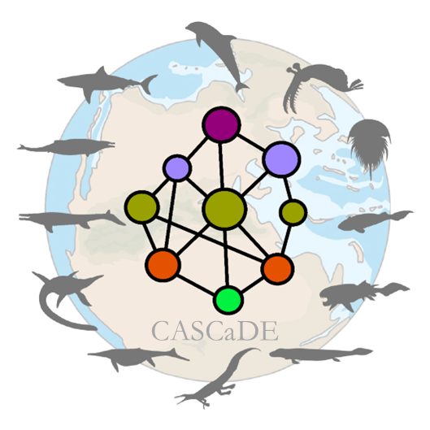

We connect foraging biology and species interactions to explore the dynamics of species and the stability, structure and function of ecological communities.

<!-- PROJECT 1 -->
## <i class="fa-solid fa-skull"></i> Extinctions
::: {.grid}

::: {.g-col-7}

:::

::: {.g-col-5}
[How does community structure mediate secondary extinction cascades and underpin marine ecosystem resilience during rapid climate change?]{.research-question}

In collaboration with palaeontologists at the University of Leeds, the **CASCADE** project investigates how the structure of marine food webs determines whether an ecosystem collapses or survives during rapid climate change. By reconstructing ancient feeding networks and simulating extinction cascades, we test if modern ocean communities have evolved greater resilience to stressors like global warming and acidification compared to their prehistoric ancestors.
:::

:::

 

<!-- PROJECT 2 -->
## <i class="fa-solid fa-carrot"></i> Optimal Foraging

::: {.grid}

::: {.g-col-5}
We explore how optimal foraging and other traits underpin predictions about the dynamics and stability of communities facing multiple simultaneous threats.
:::

::: {.g-col-7}

:::

:::

 

<!-- PROJECT 3 -->
## <i class="fa-solid fa-arrows-to-circle"></i> Stressors

::: {.grid}

::: {.g-col-7}

:::

::: {.g-col-5}
blah blah blah
:::

:::

 

<!-- PROJECT 4 -->
## <i class="fa-solid fa-chart-line"></i> Stability

::: {.grid}

::: {.g-col-5}
[How does food web structure determine the temporal stability of ecological communities?]{.research-question}

We work on how community structure and species interactions affect community stability.
:::

::: {.g-col-7}

:::

:::
